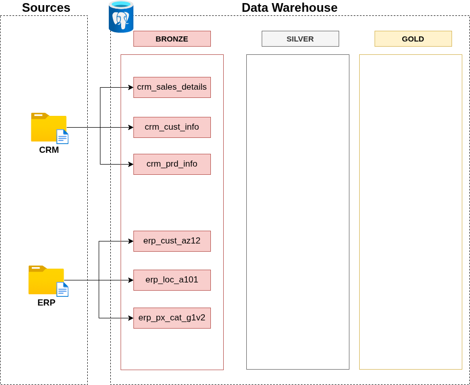

# Creazione del Bronze Layer

Per procedere nella creazione di questo Layer e fare le cose a modo bisogna prima di tutto cercare di capire quale è la giusta procedura da eseguire.

Al momento ci troviamo nel aver creato il Database e aver fatto anche fatto i vari schema che ci servono quindi ora dobbiamo passare a lavorare alla fase di creazione a modo di questo specifico layer mantenendo le regole che abbiamo definito nel diagramma architetture.

## Analisi

Il primo passo è capire come è stutturato e capire la natura del sorgente dei dati che stiamo andando a prendere.
A seconda della tipologia di come sono tali sogenti di file la procedura può cambiare perché si può passare da un classica discussione tra tra individui oppure nel leggere la documentazione del sistema di sorgente.

## Fare codice

Subito dopo aver chiarito tutti i dubbi della sorgente dei dati possiamo procedere nella creazione a modo di tutto quella parte di codice di cui abbiamo bisogno.

## Validazione

Controllo del codice scritto e anche della sua validità per poi il suo utilizzo anche in futuro.

## Documentazione

Per finire la documentazione non riguarda solamente la parte generale ma anche di andare a scrivere il quello che serve per essere capito anche a distanza di tempo.
C'è anche da tenere conto la fase di creare e/o aggiornare la documentazione con Git.

