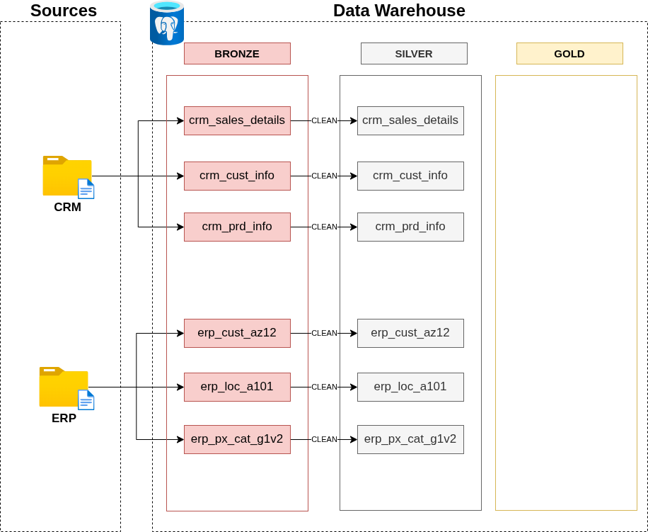
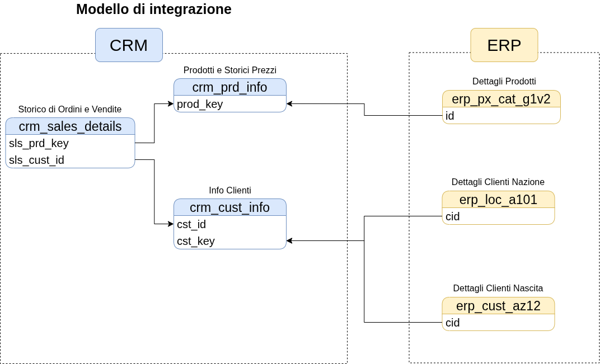

# Creazione del Silver Layer

Per ora la procedura di costruire il Silver Layer potrebbe risultare la parte più complicata da fare dato che dopo aver ricevuto i dati il grosso del lavoro viene fatto in questo Layer.

**Ma cosa bisogna fare?**
Per rispondere a questa domanda bisogna pensare che ora in questo Layer bisogna pulire un poco i dati non intendo il fatto di togliere via un poco di polvere, ma il fatto di andare ad analizzare ogni valore e cercare di portare i dati nello stato per poi essere usati per lavorare.

## Analisi

Ecco quindi la prima fase riguarda proprio il dover analizzare e capire i dati in questo modo da avere sicurezza che i dati che abbiamo preso dalla sorgente sono stati presi in modo adeguato.

## Fare codice

Ora avviene il processo più tedioso da fare dato che dobbiamo fare in modo che dati che abbiamo vengano rimessi a nuovo in questo Layer.

Il procedimento per fare tale cosa riguarda il fatto del ripulire i dati dato che non è mai vero che i dati della sorgente siano sempre perfetti: cosa sto cercando di dire è che magari ci sono dati che sono stati inseriti in modo sbagliato oppure hanno altri minori errori che potrebbero in futuro rendere complicata la loro analisi.

Il processo in questo ramo è diviso in principalmente in tre particolari parti.

1. **Controllo della qualità dei dati dal bronze Layer**
2. **Scrivere il codice che permette la pulizia dei dati**
3. **Caricare i dati puliti nel Silver Layer**

## Validazione

Dopo aver fatto tutta la procedura di pulizia si può passare al processo in cui si può verificare che tutti i dati sono stati ripuliti al meglio e quindi che il Layer in questione è terminato ed pronto per poi passare alla prossima fase.

Naturalmente se le cose non sono chiare e pulite in questa sezione è normale tornare indietro nel processo di codice per fare in modo che quando si ritorna a questo passaggio le cose devono essere apposto.

## Documentazione

Per finire se tutti i passaggi sono stati fatti nel modo giusto e siamo arrivati al punto che i dati sono pronti e il controllo a dato valore positivo possiamo dire di aver terminato il Layer Silver e quindi possiamo concludere la documentazione di tale grossa fase.

Inoltre dopo aver terminato la documentazione fare anche il caricamento con Git per tenere traccia di tale fase.

