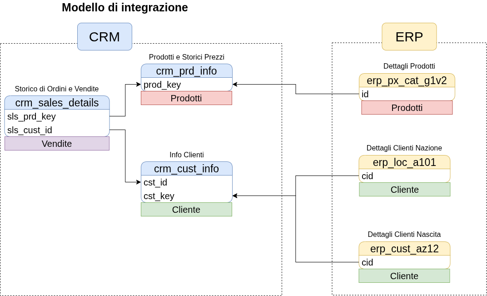
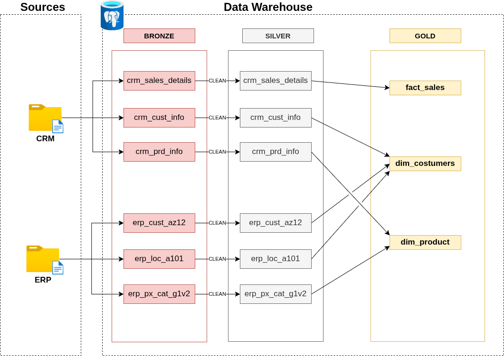

# Creazione del Gold Layer

Al momento dopo aver terminato il Layer Silver il prossimo Layer da svolgere è il Gold Layer.
Solo che nel creare questo Layer non è una questione di semplice dato che questo piano è di solito quello usato dal mondo Business quindi dobbiamo adattare i dati a quel mondo.

## Analisi

La parte di analisi richiede quindi di andare ad individuare quali sono queste domande che possono essere fatte nel mondo Business e da questo poi anche capirle in questo modo da creare qualcosa di adeguato nel Layer Gold.
Ecco quindi che in questa fase si va nella scelta di quale sia il giusto tipo di Data Model da utilizzare per il nostro caso.

### Tipi di Data Model

Ci sono due principali tipologie di Data Model che si chiamano Star Schema e Snowflake Schema.

**Star Schema** sono delle tabelle che sono collegate tra di loro e sono composte da una tabella centrale (fact table) e da diverse tabelle dimensionali (dimension tables) che si collegano alla fact table.

**Snowflake Schema** è un'estensione dello Star Schema, dove le tabelle dimensionali sono normalizzate e si collegano ad altre tabelle dimensionali.

### Dimension e Fact table

Le dimension table sono delle tabelle che nei loro dati contengono descrizioni delle infomazioni dei dati a cui sono state abbinate.
In contrario le fact table sono delle tabelle che contengono infomazioni che ti permettono di viaggiare anche poi tra le dimension table.

## Fare codice

Dopo aver capito le risorse che abbiamo a disposizione e quali sono le condizioni dopo la nostra analisi iniziale ecco che possiamo a procedere a scrivere codice in modo cosi da creare delle risorse ottime.

La procedura nel fare questa cosa di solito si divide in tre parti:

1. **Costruire il Business**
2. **Capire cosa sono le Dimensioni e i Fatti** -> questo aiuta poi a rinominare meglio le tabelle.
3. **Rinominare in modo chiaro il le tabelle**

## Validazione

La fase di validazione dobbiamo verificare che il tutto sia stato fatto a modo non solo seguendo la procedura indica per questo Layer, ma fare il controllo di aver seguito tutte le regole pre impostate ad inizio del progetto.

## Documentazione

Quando finalmente è tutto finito è arrivato il momento di fare tutta la procedura di documentazione.
Solo che oltre ad aggiornare i diagrammi fatti in questa ultima fase dato che abbiamo cambiato molte cose nella nostra stuttura una buona cosa è quello di rilascaire una documentazione più dettagliata di come lavorare da qui in poi.
Sto parlando della questione che al momento abbiamo cambiato i nomi di tabelle, colonne e ci sono colonne che magari prima non c'erano oppure adesso ci sono ecco quindi che dobbiamo scrivere una guida.

