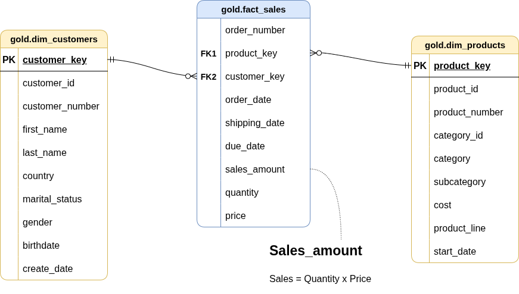

# Come usare il Gold Layer

## Struttura visiva

Questa è la struttura finale del Database al Layer Gold che è stata pensata per un utilizzo Business, come si può notare ci sono due dimensional tabella e una fact tabella.

Inotre puoi già vedere che essendo un modello basato allo schema a stella possiamo già vedere quali sono le colonne che interaggiscono con le altre tabelle.

Di seguito parliamo un poco più nel dettaglio per come è costruita ogni singola tabella.

### 1. **gold.dim_costumers**

- **Scopo:** Questa tabella contiene le informazioni dei clienti.

| Colonna Name | Data Type | Descrizione |
| :--- | :---: | :--- |
| *customer_key* | INT | Chiave surrogata (Surrogate Key) che identifica univocamente ogni record del cliente nella tabella dimensionale. |
| customer_id | INT | Identificativo numerico univoco assegnato a ciascun cliente nel sistema sorgente. |
| customer_number | VARCHAR(50) | Codice alfanumerico che rappresenta il cliente, utilizzato per il tracciamento e il riferimento. |
| first_name | VARCHAR(50) | Il nome del cliente. |
| last_name | VARCHAR(50) | Il cognome o il nome di famiglia del cliente. |
| country | VARCHAR(50) | Il paese di residenza del cliente (es. 'Australia'). |
| marital_status | VARCHAR(50) | Lo stato civile del cliente (es. 'Married', 'Single'). |
| gender           | VARCHAR(50)   | Il genere del cliente (es. 'Male', 'Female', 'n/a').                                          |
| birthdate        | DATE          | La data di nascita del cliente, formattata come YYYY-MM-DD (es. 1971-10-06).                  |
| create_date      | DATE          | La data e l'ora in cui il record del cliente è stato creato nel sistema.                      |

---

### 2. **gold.dim_products**
- **Scopo:** Fornisce informazioni sui prodotti e sui loro attributi commerciali.
- **Colonne:**

| Nome Colonna         | Tipo di Dato  | Descrizione                                                                                   |
|---------------------|---------------|-----------------------------------------------------------------------------------------------|
| *product_key*         | INT           | Chiave surrogata (Surrogate Key) che identifica univocamente ogni record del prodotto nella tabella dimensionale. |
| product_id          | INT           | Identificativo univoco assegnato al prodotto per il tracciamento interno e i riferimenti.     |
| product_number      | VARCHAR(50)   | Codice alfanumerico strutturato che rappresenta il prodotto, usato per categorizzazione o inventario. |
| product_name        | VARCHAR(50)   | Nome descrittivo del prodotto, inclusi dettagli chiave come tipo, colore e dimensione.        |
| category_id         | VARCHAR(50)   | Identificativo univoco della categoria del prodotto, che si collega alla sua classificazione principale. |
| category            | VARCHAR(50)   | La classificazione macro del prodotto (es. 'Bikes', 'Components') per raggruppare articoli correlati. |
| subcategory         | VARCHAR(50)   | Classificazione più dettagliata del prodotto all'interno della categoria (es. il tipo specifico di articolo). |
| maintenance_required| VARCHAR(50)   | Indica se il prodotto richiede manutenzione programmata (es. 'Yes', 'No').                    |
| cost                | INT           | Il costo o prezzo base del prodotto, misurato in unità monetarie.                             |
| product_line        | VARCHAR(50)   | La linea di prodotti o serie specifica a cui appartiene l'articolo (es. 'Road', 'Mountain').   |
| start_date          | DATE          | La data in cui il prodotto è diventato disponibile per la vendita o l'uso nel catalogo.       |

---

### 3. **gold.fact_sales**
- **Scopo:** Memorizza i dati transazionali delle vendite per scopi analitici e di calcolo delle metriche.
- **Colonne:**

| Nome Colonna    | Tipo di Dato  | Descrizione                                                                                   |
|-----------------|---------------|-----------------------------------------------------------------------------------------------|
| order_number    | VARCHAR(50)   | Identificativo alfanumerico univoco per ogni ordine di vendita (es. 'SO54496').               |
| *product_key*     | INT           | Chiave surrogata che collega la riga d'ordine alla tabella dimensionale dei prodotti (`gold.dim_products`). |
| *customer_key*    | INT           | Chiave surrogata che collega l'ordine alla tabella dimensionale dei clienti (`gold.dim_customers`).|
| order_date      | DATE          | La data in cui è stato effettuato l'ordine da parte del cliente.                              |
| shipping_date   | DATE          | La data in cui l'ordine è stato spedito fisicamente al cliente.                               |
| due_date        | DATE          | La data di scadenza entro cui è richiesto il pagamento dell'ordine.                           |
| sales_amount    | INT           | Il valore monetario totale della vendita per la singola riga d'ordine, in unità di valuta intere (es. 25). |
| quantity        | INT           | Il numero di unità del prodotto ordinate per la specifica riga d'ordine (es. 1).              |
| price           | INT           | Il prezzo unitario del prodotto applicato alla riga d'ordine, in unità di valuta intere (es. 25). |