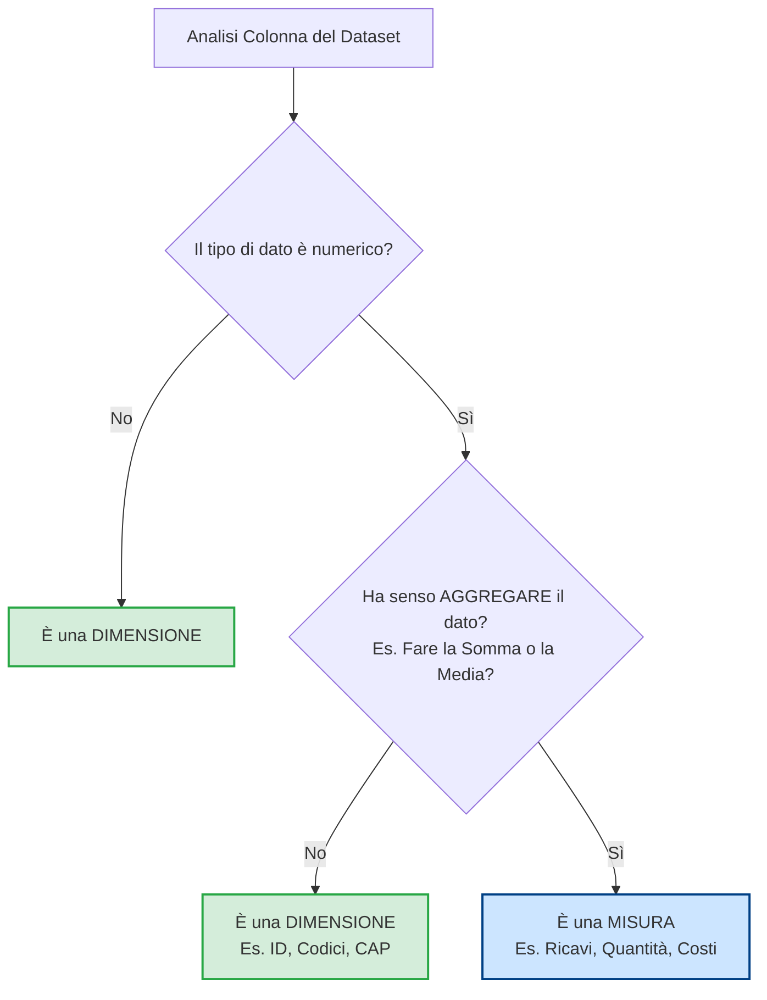

# Analisi EDA

Un altro punto fondamentale della conoschenza di SQL è oltre a capire come si costruisce un Warehouse è quello di capire anche come è costruito in Database e questo processo viene chiamato EDA (Exploratory Data Analysis).

Per svolgere questo processo le cose da fare sono quelle di capire come funziona il Database e questo viene fatto usando delle query SQL che vengono fatte al Database.

Però prima di procedere a fare questa analisi uno dei primi passi da fare è quello di fare prima una piccola distinzione dei dati che sono presenti nel Database che riguarda il fatto di capire cosa sono le colonne.

### Dimensioni e Misure

Le dimensioni sono colonne che contengono dati descrittivi o categorici.
Le misure sono colonne che contengono dati numerici e quantificabili.

Per esempio, in un dataset di vendite, "Nome Prodotto" o "Categoria" sarebbero dimensioni, mentre "Quantità Venduta" o "Prezzo" sarebbero misure.

Questa distinzione è cruciale per l'analisi, poiché le dimensioni vengono spesso utilizzate per filtrare, raggruppare e segmentare i dati, mentre le misure sono aggregate per ottenere insight quantitativi.

Però c'è una piccola cosa da fare in caso ci siano delle colonne numeriche che dopo una attenta analisi non devono essere considerate come misure, ma devono essere considerate come dimensioni.
Per questo utilizzare questo grafico potrebbe essere utile:

Una volta compresa questa distinzione, il passo successivo nell'EDA è l'analisi delle tabelle.

## Esplorazione del Database

L'accesso a un nuovo ecosistema di dati richiede una mappatura iniziale che va oltre la semplice visualizzazione delle tabelle tramite interfaccia grafica.
Questa prima analisi interroga direttamente i metadati di sistema per ottenere un censimento strutturato dell'ambiente di lavoro.
Comprendere l'esatta consistenza numerica delle tabelle, delle viste e delle relative colonne permette di stimare la complessità del perimetro analitico e di verificare i pattern di denominazione degli oggetti (naming convention).
Si tratta di un'azione fondamentale per validare la salute dell'architettura prima di procedere a interrogazioni complesse, garantendo che non vi siano elementi mancanti o configurazioni anomale nel database.

## Esplorazione delle Dimensioni

Le dimensioni costituiscono il contesto descrittivo e categorico del patrimonio informativo aziendale. Isolare i valori univoci di queste colonne è un passaggio indispensabile per misurarne la cardinalità, ovvero per capire quante categorie distinte popolano il dataset. Senza questa verifica, non sarebbe possibile prevedere il comportamento delle aggregazioni numeriche. L'analisi permette di esplorare i livelli gerarchici naturali dei dati, come il legame strutturale che unisce una macro-categoria a una specifica sottocategoria o a un singolo prodotto. Identificare la distribuzione e la granularità di queste informazioni testuali definisce i confini dei filtri e dei raggruppamenti su cui si baseranno i futuri report di business.

## Esplorazione delle Date

Il fattore temporale governa la stragrande maggioranza delle dinamiche di business e condiziona direttamente la validità dei modelli analitici. Questa ispezione stabilisce con precisione millimetrica i confini temporali del dataset, individuando i punti di inizio e di fine dell'attività registrata. Conoscere l'estensione della cronologia aziendale serve a determinare se il dataset è sufficientemente profondo per valutare trend storici, ciclicità o stagionalità. Parallelamente, l'analisi delle date anagrafiche dei soggetti permette di derivare metriche dinamiche come l'età, trasformando un dato puramente statico in un elemento utile a tracciare il profilo generazionale e la longevità del parco clienti.

## Esplorazione delle Misure

Le misure rappresentano gli elementi quantificabili e numerici su cui si poggiano i calcoli delle performance aziendali. In questa fase l'obiettivo è determinare i grandi numeri assoluti (i cosiddetti Key Metrics globali) a livello macroscopico, senza applicare segmentazioni o filtri. Calcolare i totali volumetrici, i fatturati complessivi e le medie di prezzo offre una linea di base per comprendere il volume d'affari dell'azienda. Questo passaggio è cruciale anche per svelare la struttura interna delle transazioni: il confronto tra i conteggi assoluti e quelli univoci permette infatti di comprendere se i record si sviluppano su più righe ripetute (come i singoli prodotti all'interno di un unico ordine), evitando sovrastime nei calcoli successivi.

## Analisi della Magnitudo

L'analisi della magnitudo rappresenta il punto d'incontro in cui le misure numeriche vengono spaccate e distribuite attraverso le lenti delle dimensioni categoriche. Lo scopo teorico di questa tecnica è misurare il peso specifico, l'impatto e la rilevanza delle singole entità rispetto al volume complessivo del business. Attraverso la combinazione e il raggruppamento di tabelle dei fatti e tabelle dimensionali, i grandi numeri astratti si trasformano in risposte strategiche. Questa scomposizione evidenzia dove si concentra il valore dell'azienda, rivelando ad esempio quali mercati geografici trainano i volumi o quali macro-categorie merceologiche sostengono la maggior parte dei ricavi operativi.

## Analisi del Ranking

Mentre l'analisi della magnitudo mostra la distribuzione generale dei dati, l'analisi del ranking si concentra specificamente sull'isolamento dei comportamenti estremi all'interno del dataset. Dal punto di vista teorico, questa tecnica ordina e seleziona i dati per far emergere i picchi di eccellenza (i Top Performers) e le sacche di inefficienza (i Bottom Performers). Identificare i clienti a più alto valore o i prodotti meno redditizi fornisce al business un'indicazione immediata su dove allocare le risorse, quali strategie di marketing implementare o quali rami operativi ottimizzare. L'adozione di funzioni analitiche avanzate e di strutture nidificate garantisce la flessibilità necessaria per gestire correttamente i casi di parità nei punteggi e per isolare sotto-insiemi precisi di record su cui agire.
